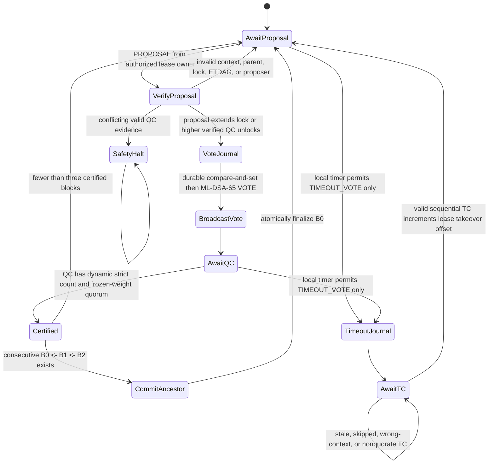
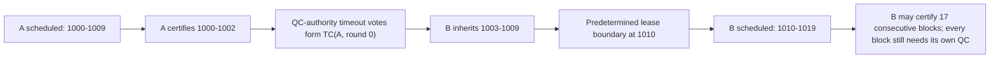
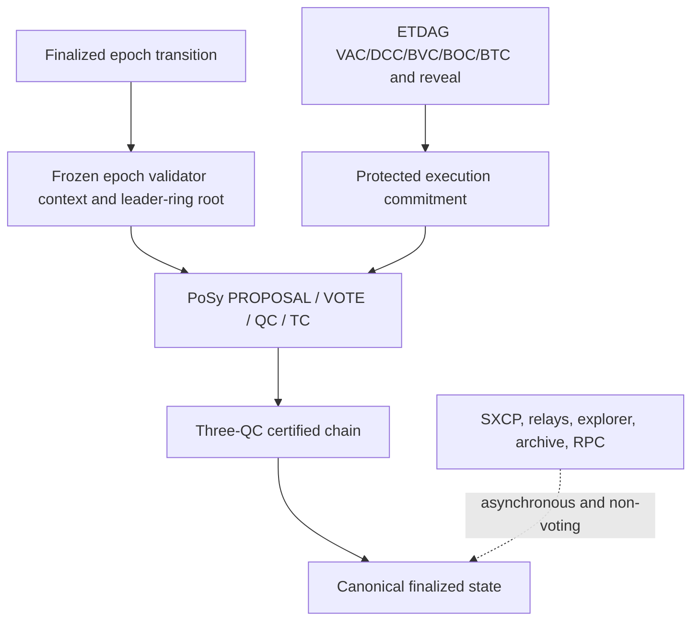

# PoSy v3 simplified consensus architecture

Status: proposed, not active.

## State machine

## Lease and takeover

If B also fails before the boundary, a sequential `TC(B, round 1, previous=TC(A))` authorizes C for the remaining lease. Local peer health and wall clock never appear in the authority calculation.

## Boundaries

