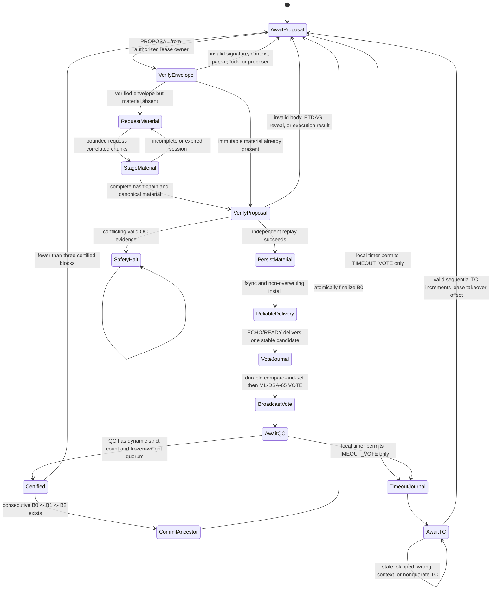
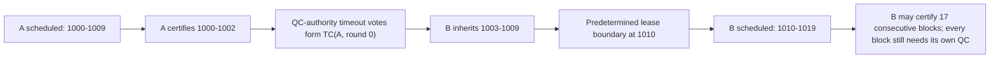
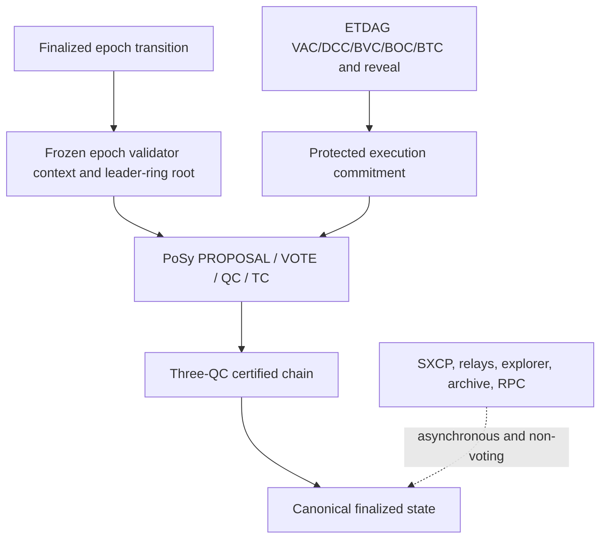
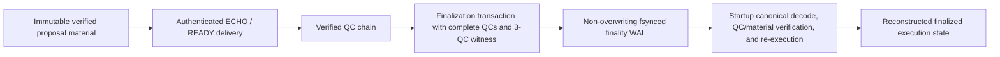

# PoSy v3 simplified consensus architecture

Status: proposed, not active. For the Genesis-bound initial epoch, the
production validator role runtime now constructs and spawns this authenticated
driver with the deterministic core adapter when ETDAG is deferred or the
protected adapter when a finalized ETDAG permit is present. The applied Genesis
still defers ETDAG, so the checked-in runtime path selects the core adapter. None
of this activates the proposal or satisfies launch qualification. Future v3
role startup loads and re-verifies the durable transition chain and prior replay
inputs, then fails closed at the still-missing finalized-execution authority
proof.

## State machine

The proposal envelope is intentionally insufficient to authorize ECHO, READY,
or VOTE. A validator first obtains the exact content-addressed proposal material
record, reconstructs it through a bounded request-correlated hash chain when it
is absent, independently replays the block/protected execution, and durably
installs the verified record. Only then may authenticated reliable delivery
begin. The current durable core adapter can construct and replay deterministic
empty blocks while no finalized ETDAG activation permit exists. A production
protected-ETDAG material adapter and schedule-neutral verified coordinator APIs
are now implemented and tested: they consume the certified target-admission
context and protected input without importing a proposer schedule, execute the
exact candidate, and independently replay received material. The validator role
runtime now selects this adapter from a finalized permit, derives its authority
by reopening the durable finality WAL and bounded material tail, and installs
the authenticated schedule-neutral ETDAG ingress transactionally with the
execution snapshot and simplified-consensus ingress. Startup rollback, worker
failure, and shutdown remove any installed ingress. The same protected startup
now constructs the schedule-neutral H+3 producer, obtains its exact finality
authority from that durable WAL, requires a canonical externally provisioned
public ML-KEM registry for the assigned frozen cluster, durably journals the
local ML-DSA vote, and broadcasts votes/certificates through the authenticated
dynamic frozen-set path. It fails closed when the registry is missing and does
not synthesize next-epoch authority near a boundary.

## Lease and takeover

If B also fails before the boundary, a sequential `TC(B, round 1, previous=TC(A))` authorizes C for the remaining lease. Local peer health and wall clock never appear in the authority calculation.

## Boundaries

## Durable material and finality boundary

Proposal material is stored separately by stable candidate ID so a finality WAL
record can remain bounded while still referring to immutable full block/body
and protected-execution inputs. Startup replay rejects a missing, substituted,
noncanonical, wrong-context, or non-replayable material record and rejects any
invalid or nonconsecutive finality witness. For either initial-epoch material
mode, role-runtime wiring installs the durable safety, material, and finality
stores, replays the v2 boundary state, and publishes the reconstructed execution
snapshot. A finalized ETDAG permit additionally installs the protected
authority, schedule-neutral ingress, and H+3 producer lifecycle; the applied
Genesis currently supplies no such permit. The autonomous five-driver harness
now proves restart, material recovery, state-sync healing, takeover, and
finality across five OS processes. Five full `synergy-node` deployments,
protected execution, and node-database convergence qualification remain
blocking.

For a verified v3-to-v3 boundary, the finality sink can now retain the exact two
unfinalized certificates and proposal-material records from the previous-epoch
tail, commit the first boundary transaction, continue into current-epoch
material, and replay the combined WAL after restart. The driver builds that
boundary transaction only from its receiver-owned verified transition and
retries the same durable transaction deterministically if local consensus state
was not advanced after the sink committed. The role runtime walks adjacent
durable transition proofs, re-verifies them against the exact prior context,
and reconstructs the previous-epoch material/finality replay inputs. Production
later-epoch startup still stops at the independently enforced executed-transition
authority proof because finalized execution does not yet expose that proof.

## Proof-aware later-epoch state sync

A v3-to-v3 state-sync bundle is accepted only in the context of an independently
verified, durable epoch-transition proof. That proof contains the exact final
three-QC tail of the previous epoch, keeps the latest certified parent distinct
from the latest finalized seed, and binds the transition subject and complete
dynamic next validator set. The transition-aware stager, state-machine install,
and restart paths are implemented and tested; a bare bundle without the verified
proof and a bundle that substitutes the transition-tail finality claim are
rejected.

This is component capability, not later-epoch production activation. The
transition-aware finality sink, driver boundary transaction, durable transition
loading, and prior replay composition are implemented and tested. The
transition authorization subject is schema v2 and deliberately excludes the
block/QC identifiers that would create a cryptographic fixed point. Production
still fails closed because finalized execution does not yet expose the compact
state/receipt inclusion proof needed to show that subject was committed by the
exact finalized QC.

## P2P ingress and target binding

The simplified-consensus wire path reads only a bounded envelope prefix before
allocating the declared payload, identifies the exact message kind, and applies
its proposal, vote, certificate, control, or state-sync-chunk limit. Targeted
responses are authorized by the validator identity bound to the current
authenticated peer session and the frozen epoch set; a socket address is not
validator authority, and an address rebound to a different validator is
rejected. These controls are implemented and tested. The autonomous driver
harness exercises this bounded message family through an authenticated router,
but real socket reconnect/backpressure qualification remains open.

## Dynamic membership boundary

The validator count is derived from each finalized frozen epoch context. The
first v3 activation proposal contains five validators only because five
hardware-backed validators are initially available; five is not a protocol
constant or cluster ceiling. Later approved validators require a certified
v3-to-v3 epoch transition that freezes the replacement membership, weights,
keys, cluster map, leader ring, and quorum threshold for every node at the same
boundary. The primitives already derive rings and quorums for other set sizes,
and proof-aware transition state sync can reconstruct and durably install a
verified dynamic next-epoch context. Cross-epoch WAL replay and driver boundary
transactions are implemented at component scope. The production
executed-transition authority verifier is not complete, so onboarding is
specified and dynamically modeled (including a verified 5-to-7 transition) but
not yet launch-ready.
