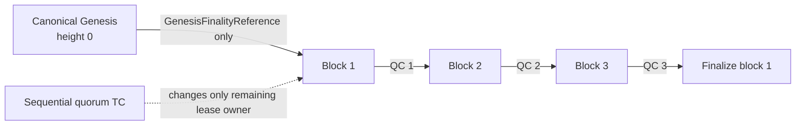

# PoSy v3 PR-readiness crosswalk

Status: **documentation audit; not an activation authorization**
Scope: separate Testnet-v3 PoSy chain at block zero, Chain ID `1266`, technical
network ID `testnet`, protocol `posy/3.0`, and the initial five-validator
epoch.
Audit boundary: this record evaluates the current `posy-pr-ready-rc33`
worktree. It does not replace a governed manifest, Genesis, approval, test
evidence, release signature, deployment plan, or go/no-go record.

## Decision record

The public proposal/schema set is:

- `launch/TESTNET_V3_POSY_SIMPLIFIED_PARAMETER_SCHEMA_V4.json`;
- `launch/TESTNET_V3_POSY_SIMPLIFIED_PARAMETER_PROPOSAL.json`; and
- `launch/TESTNET_V3_POSY_SIMPLIFIED_PARAMETER_PROPOSAL_VERIFICATION.json`.

It specifies `fresh_genesis_block_zero`, `posy/3.0`, one initial
five-validator cluster, strict `4-of-5` count quorum, independently checked
frozen-weight quorum, a ten-block immutable leader lease, one ordinary `VOTE`
phase, `QC` as the only normal certificate, `TC` as the exceptional
certificate, and three-QC finality. The proposal verification correctly records
that the runtime refuses activation: it has no approval ID or activation
coordinate. It remains a proposal and is not a runtime parameter source.

The matching canonical release input is
`launch/posy-v3-etdag-governance-inputs/posy-simplified-parameter-manifest.for-release.json`.
It carries a final decision ID, epoch `0`, first block height `1`, and stable
hashes, but it is still a public **unsigned input** until the final Genesis and
ETDAG membership anchor are included in a verified V4 governance approval.

The older schema-2 record,
`launch/TESTNET_V3_CONSENSUS_PARAMETERS.json`, is a historical `posy/2.2`,
six-validator record. It must not be used to produce a PoSy v3 Genesis,
topology, release, wallet trust value, or deployment bundle.

## Fresh-Genesis finality boundary

The active implementation work introduces `GenesisFinalityReference` and
`SimplifiedFinalityParent`. Genesis is a distinct finality parent for block 1;
it is not a quorum certificate and no fabricated Genesis QC is permitted. From
block 2 onward, a proposal parent must be a real independently verifiable QC.
The ordinary three-QC finality rule is unchanged:



This replaces the old migration-language assumption that the first v3 block
extends a v2.2 transition QC. A timeout certificate never supplies a parent,
commits a block, changes membership, lowers quorum, or converts Genesis into a
QC.

## Requirements crosswalk

| Requirement | Current primary implementation / candidate artifact | PR evidence status | Release condition still open |
| --- | --- | --- | --- |
| Fresh block-zero start without legacy-chain authority | schema-4 manifest; `posy_simplified_parameters.rs`; typed Genesis parent across certificates/state/driver/finality/role-runtime and harness paths | Source implementation and focused deterministic tests present | Current compile/test evidence, final P3 Genesis, and five public identities/weights |
| One normal path: `PROPOSAL -> VOTE -> QC` | `consensus/simplified_posy/certificates.rs` and `driver.rs` | Component implementation present | Full role-runtime and socket-stack qualification |
| Exact dynamic quorum | frozen `SimplifiedEpochContext`; strict count and weight verification | Component implementation present; initial schema declares four of five | Approved public weights and leave-one-out preflight for the actual five-validator set |
| Three-QC finality | `state.rs`, `finality.rs`, finality WAL | Component implementation present | Focused regression coverage for block 1 and full node/database finality qualification |
| Deterministic ten-block leadership and safe takeover | `schedule.rs`, `certificates.rs`, `state.rs`, `driver.rs` | Component implementation present | Real five-node timer, partition, restart, and socket evidence |
| No local election or quorum reduction | schema-4 constants and simplified verifier | Component implementation present | Review of every production caller and release configuration |
| Durable signing, restart, and SafetyHalt | signing authority, state, material, finality WAL, state sync | Component implementation present | Full restart/state-sync/fault-injection evidence on the production role runtime |
| Dynamic later onboarding | `schedule.rs`, `transition.rs`, transition-bound material/finality paths | In integration | Executed governance/transition-subject authority proof and a real later-epoch onboarding rehearsal; no live-epoch mutation |
| ETDAG and block finality separation | protected material and target-admission modules; `launch/posy-v3-etdag-governance-inputs/` | Public unsigned inputs are being prepared | Final governed parameter root, fee-schedule root, membership anchor, protected execution, and five-node end-to-end evidence |
| Wallet trust inputs | governed ETDAG release request path | Not issued | Signed public values for the two ETDAG roots and membership anchor; wallet release gate must pass independently |
| Five-validator deployment configuration | `runtime/config/testnet/posy-v3-five-validator/` public-only templates and five-validator preflight | Preparation only | Rendered approved public topology, signed artifacts, and all-node preflight evidence |
| Canonical parameter controls | schema-4 proposal/verification, canonical release input, and `PoSy_Consensus_Parameter_Control_Workbook_v3_PROPOSAL.xlsx` | Proposal digests and formula-driven initial quorum/weight model verified; workbook remains visibly blocked | Final V4 decision/signature, exact validator identities/weights, and executed qualification evidence |

## Documentation inventory and synchronization result

### Current candidate sources

These documents describe the intended simplified-v3 design and are useful
review inputs, but none alone authorizes activation:

- `docs/posy-v3/POSY-00E-SIMPLIFIED-CONSENSUS-AMENDMENT.md`;
- `docs/posy-v3/ARCHITECTURE.md` and `CONSENSUS_OBJECT_SCHEMAS.md`;
- `docs/posy-v3/REQUIREMENTS_CROSSWALK.md` and `REQUIREMENTS_DELTA.md`;
- `docs/posy-v3/WHITEPAPER_ENGINEERING_UPDATE.md` and
  `WHITEPAPER_PUBLIC_INVESTOR_UPDATE.md`;
- `runtime/docs/architecture/posy-v3-simplified-consensus.md`;
- `runtime/docs/runbooks/posy-v3-five-validator-preflight.md` and
  `posy-v3-fresh-chain-launch-preparation.md`;
- `runtime/docs/runbooks/posy-v3-dynamic-validator-onboarding.md` and
  `posy-v3-state-sync-recovery.md`; and
- `runtime/config/testnet/posy-v3-five-validator/README.md`.

The two whitepaper files are explicitly publication proposals. No external
whitepaper has been updated or represented as updated by this audit.

### Remaining documentation corrections before a release PR

The primary P3 architecture, normative amendment, requirements crosswalk,
legacy-retirement policy, preflight, and public five-validator templates now
describe the fresh P3 start. The following historical or operational surfaces
still require explicit retirement labels or P3 replacements before a release
PR claims complete operational readiness:

| File(s) | Problem | Required correction |
| --- | --- | --- |
| `runtime/docs/consensus/POSY_SIMPLE_V1.md`, `CONSENSUS_MIGRATION_RUNBOOK.md`, `CONSENSUS_MESSAGE_SCHEMAS.md` | They describe coordinated/six-validator or v2.2 migration behavior rather than the P3 profile. | They are explicitly labelled historical and non-authoritative. Do not present their messages or migration boundary as a P3 fallback. |
| `launch/TESTNET_V3_CONSENSUS_PARAMETERS.json`, its decision/verification records, `BASELINE_VALIDATOR_COUNT_RESOLUTION.md`, `BLOCKER_EVIDENCE_MATRIX.md`, `LAUNCH_CHECKLIST.md`, and historical handoffs | They are six-validator `posy/2.2` artifacts or record older evidence. | Retain only as clearly labelled historical evidence. Add a P3 release-control record rather than mutating or reusing their roots, counts, or approval IDs. |
| `runtime/docs/architecture/dynamic-validator-clusters.md`; `runtime/docs/runbooks/community-validator-onboarding.md`, `validator-state-sync.md`, `protocol-state-sync-repair.md`, `strict-fleet-status.md`, and `public-rpc-atlas-backend-safety.md` | They contain migration-era topology or Chain `1264` / `synergy-testnet-v3` commands. | They are explicitly labelled historical and invalid for P3. The source-aligned P3 onboarding and state-sync replacements intentionally omit unverified live CLI commands; transport/RPC procedures still require current-topology replacements. |
| `runtime/scripts/testnet/run-posy-simplified-five-node-harness.sh` and `run-posy-simplified-five-driver-harness.sh` | Separate wrappers invoke the state-machine worker harness and autonomous production-driver harness respectively. | Release evidence must state exactly which harness ran and retain both results. |
| `.github/workflows/chain1266-release.yml` | The existing signed-tag release workflow still packages the currently deployed pre-P3 release layout and is not a P3 activation workflow. | Do not use it to publish P3. Replace or separately govern its artifact, Genesis, approval, role, and configuration inputs only after the P3 release gates exist. The new `posy-v3-pr-verification.yml` is qualification-only and cannot publish. |
| `launch/VALIDATOR_VPN_ARCHITECTURE.md` and related historical VPN records | They record a former address plan and a 21-validator package, not the current initial five-validator public topology. | Publish a new public P3 transport plan derived from approved current records; never infer consensus authority from transport routing. |

Historical incident logs, backups, and deletion manifests may remain as audit
evidence but cannot be copied into, parsed as, or used to bootstrap the new P3
chain.

## Release blockers and risks

1. **The P3 release is unsigned and Genesis is incomplete.** The canonical
   release-input manifest exists, but no final executed-deployment Genesis,
   five-validator activation/root set, ETDAG membership anchor, or verified V4
   governance signature exists as a releasable P3 artifact.
2. **Current compile/test evidence is missing.** Static review found the typed
   Genesis parent propagated through role runtime, harnesses, and tests, but the
   current worktree has not been compiled or run under the host's RAM limit.
3. **ETDAG trust artifacts are not issued.** Unsigned public inputs do not
   satisfy the wallet release gate or authorize protected execution.
4. **Later-epoch onboarding remains fail closed.** Dynamic membership code is
   not permission to add a validator without an independently verified,
   executed transition-subject authority proof.
5. **Qualification is incomplete.** Focused unit/harness evidence cannot
   substitute for full role-runtime/socket, restart/state-sync, Byzantine,
   performance/soak, and release reproducibility evidence.
6. **Documentation drift is a release risk.** P3 materials must not point an
   operator to a v2.2 migration, a six-validator threshold, Chain ID `1264`,
   or obsolete VPN topology.
7. **The custody signer is a separate repository dependency.** The Address
   Engine V4 signer and Core verifier now have exact 26-field request parity on
   static inspection, including preserved-V3 and rotated-V1 public authority
   forms, but both still require serialized build/test evidence and a separate
   clean review. Unrelated Address Engine worktree changes must not be swept
   into that release.
8. **The existing signed-tag workflow is not a P3 publisher.** It still names
   and packages the deployed pre-P3 release layout. The dedicated P3 PR
   workflow added here only qualifies source and cannot sign, publish, or
   deploy. A later governed release change must replace the tag workflow's
   inputs rather than interpreting a green PR run as release authorization.

## Controlled PR verification plan

### Current static audit — 2026-08-23

The current worktree passed `git diff --check`, targeted Rust parsing/format
checks, `cargo metadata --no-deps`, shell syntax checks for both harness
wrappers, JSON parsing, TOML parsing, workbook ZIP integrity, formula-error
scanning, and visual rendering of all four workbook sheets. The proposal byte
length, SHA-256, SHA-512, and SHA3-512 parameter root independently match its
verification record. Static extraction also confirms exact 26-field parity
between the Core V4 approval request and the separate Address Engine signer.
`runtime/scripts/testnet/verify-posy-v3-pr.sh static` now reproduces the
repository-local formatting, metadata, shell, workbook-integrity, canonical
boundary, and proposal-digest checks in one bounded command.
`launch/POSY_V3_PR_DEPENDENCIES.lock.json` separately pins the source base,
SynQ commit and Aegis submodule, and vendored Core Aegis tree used for P3 PR
qualification. It is explicitly not a release approval and does not reuse the
older release workflow's dependency record.

No current Cargo build, test, harness, soak, deployment, signature, custody,
identity, Wallet, or live-node action was run under the workstation's active
RAM limit. Those gates remain open.

The verification entrypoint never contacts a node or creates/replaces
identities, trust values, release signatures, Wallet packages, or deployment
artifacts. Static mode is appropriate for the constrained workstation. Full
mode validates the frozen fresh-P3 identity inventory and pinned SNTS-01
Address Engine registry/vector hashes. Full mode must run on a host with
adequate disk and memory headroom; it forces one Cargo build job and one test
thread, runs sixteen focused test families covering consensus, both parameter
loaders, governance, Genesis, ETDAG admission/bootstrap, fresh-chain
configuration rejection, canonical SNTS-01 Address Engine/registry/standards,
identity authorization, production role startup, and simplified P2P framing,
then runs both distinct
five-node harnesses.

The PR workflow is path-gated over all P3-relevant runtime, launch,
fresh-Genesis, Address Engine standards, deployment-builder, and Genesis-contract
sources. A change to any such input triggers the same serial verifier; a green
run does not authorize activation.

```bash
runtime/scripts/testnet/verify-posy-v3-pr.sh static

POSY_V3_EVIDENCE_DIR=/tmp/posy-v3-pr-evidence \
  runtime/scripts/testnet/verify-posy-v3-pr.sh full
```

The PR workflow `.github/workflows/posy-v3-pr-verification.yml` executes full
mode on Ubuntu with the dedicated P3 dependency lock, verifies that the PR
still has the recorded authoritative-main merge base, and uploads the bounded
public harness reports, test inventories, logs, and status. Harness state
directories are never uploaded, and an exit trap scrubs the exact ephemeral
test-key locations even on failure. A green workflow is required evidence;
merely adding the workflow does not satisfy the still-open executable gate.

After source review and successful bounded tests, the release-only sequence is:

1. Produce final public P3 consensus, five-validator, ETDAG, fee, and
   membership-anchor inputs from the approved source state.
2. Build the fresh P3 Genesis candidate and independently verify its canonical
   bytes, hashes, embedded roots, validator context, and block-zero boundary.
3. Obtain the required governance authorization through the approved custody
   workflow; do not substitute or regenerate an authority silently.
4. Verify the signed release request and derived public wallet trust values
   independently before updating any wallet registry or creating distributable
   packages.
5. Render only public node configuration from the approved artifacts, run the
   all-five offline preflight, then perform the separately authorized
   five-node qualification and operational preflight.
6. Update the P3 operations, technical, schema, whitepaper-proposal, and
   deployment documentation together, with a release manifest that records the
   exact commit and all public artifact hashes.

## Proposed PR summary

> Implement the block-zero PoSy v3 finality model for Chain 1266: Genesis is a
> typed non-QC parent for block 1, every later proposal extends an independently
> verified QC, and three-QC finality remains unchanged. Preserve exact dynamic
> quorum, deterministic ten-block leases, sequential TC takeover, durable
> signer/finality state, ETDAG separation, and fail-closed dynamic onboarding.
> This PR deliberately does not authorize activation, deployment, wallet
> publication, governance signing, or reuse of legacy-chain state.

## PR acceptance checklist

- [ ] No production or test caller can fabricate or serialize Genesis as a QC.
- [ ] Block 1 succeeds only with the canonical Genesis reference; block 2 and
      later require valid QC parents.
- [ ] Existing three-QC finality and v3-to-v3 transition behavior remain
      covered by focused tests.
- [ ] Role runtime, two harnesses, finality/material/state-sync fixtures, and
      public configuration templates compile against the parent union.
- [ ] `PoSy V3 PR Verification` passes all sixteen focused test families and
      uploads distinct state-machine and production-driver harness evidence.
- [ ] The schema-4 proposal remains non-authoritative; the canonical release
      input becomes authority only as part of the complete signed P3 artifact
      set.
- [ ] Historical v2.2 and Chain 1264 records remain explicitly
      non-authoritative, and dedicated P3 operational replacements are
      reviewed before any command is used against a P3 node.
- [ ] No release, deployment, custody, wallet, workbook, or live-infrastructure
      action is represented as complete without its independently verifiable
      evidence.
