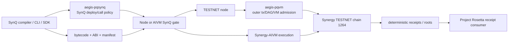

# aegis-pqsynq vs aegis-pqvm Integration Audit

Status date: 2026-05-26

## Executive Decision

Both modules are needed.

The prior source-proven architecture was **Model D**: Testnet-Beta node
admission used `aegis-pqvm`, while `aegis-pqsynq` existed as a separate
SynQ-specific policy and verification adapter. The current local integration now
implements the first **Model B** boundary in the Testnet-Beta node crate:

- the node calls `aegis-pqsynq` for inner SynQ deploy/call authorization carried
  by a versioned SynQ admission envelope;
- the node calls `aegis-pqvm` for outer Synergy TESTNET transaction admission,
  DAG/mempool admission, validator/consensus/P2P domains, and deterministic
  chain receipt/state roots;
- the node or AIVM deploy/call gate calls `aegis-pqsynq` for inner SynQ deploy
  and call authorization payloads, SynQ domain separation, chain-1264 binding,
  SynQ address derivation, and structured SynQ security errors;
- Project Rosetta consumes Synergy TESTNET receipt/index artifacts and does not
  own either cryptographic policy layer.

Model A is not chosen now because it would make the blockchain/VM PQ module
depend directly on a language-specific SynQ policy crate without a source-backed
hook. Model C is a valid future refactor if `aegis-pqvm` exposes a generic
admission hook trait, but such a trait is not present in the inspected source.
Neither module should replace the other.

Implementation evidence:

- `/Users/devpup/Desktop/Testnet-Beta/synergy-testnet/src/Cargo.toml`
  now depends on `aegis-pqsynq` through the `pqsynq` crate name.
- `/Users/devpup/Desktop/Testnet-Beta/synergy-testnet/src/synq_admission.rs`
  defines `SynQAdmissionEnvelope`, `SynQAdmissionKind`,
  `SynQVerificationSummary`, `SynQAdmissionError`, network normalization, and
  deploy/call verification adapters.
- `/Users/devpup/Desktop/Testnet-Beta/synergy-testnet/src/aegis_tx_tool.rs`
  calls `verify_transaction_payload_for_chain_admission` before the existing
  `AegisPqvmVerifier` outer transaction admission path.
- `/Users/devpup/Desktop/Testnet-Beta/synergy-testnet/src/execution.rs`
  preserves optional SynQ verification summaries and structured error codes in
  execution state and transaction receipts.
- `cargo test -p synergy-testnet --lib synq_admission::tests -- --nocapture`
  passed with 10 tests using the existing Testnet target cache.
- `cargo test -p synergy-testnet --lib execution::tests::receipt_preserves_synq_verification_summary -- --nocapture`
  passed.

## Source Inventory

### aegis-pqsynq

| Kind | Path | Evidence |
|---|---|---|
| Active embedded SynQ workspace crate | `/Volumes/xcode/Synergy-Network-Projects/synq-language/aegis-pqsynq/pqsynq/Cargo.toml` | Package `aegis-pqsynq`, library crate `pqsynq`; workspace member in `/Volumes/xcode/Synergy-Network-Projects/synq-language/Cargo.toml`. |
| Embedded package metadata | `/Volumes/xcode/Synergy-Network-Projects/synq-language/aegis-pqsynq/package.json` | JavaScript/package metadata exists beside the Rust crate. |
| Embedded crypto core | `/Volumes/xcode/Synergy-Network-Projects/synq-language/aegis-pqsynq/aegis_crypto_core/Cargo.toml` | Additional PQ substrate crate under the SynQ checkout. |
| Standalone mirror | `/Volumes/xcode/Synergy-Network-Projects/aegis-pqsynq/aegis-pqsynq/pqsynq/Cargo.toml` | Mirrors the active crate, but direct `--manifest-path` testing is blocked because the mirror inherits workspace dependencies and has no workspace root. |

`aegis-pqsynq` depends on bundled `pqrust` crates in the SynQ workspace. It does
not wrap `aegis-pqvm`, and it does not own node/DAG admission.

### aegis-pqvm

| Kind | Path | Evidence |
|---|---|---|
| Active Testnet-Beta node dependency | `/Users/devpup/Desktop/Testnet-Beta/synergy-testnet/aegis-pqvm/Cargo.toml` | Node crate `/Users/devpup/Desktop/Testnet-Beta/synergy-testnet/src/Cargo.toml` depends on `aegis-pqvm = { path = "../aegis-pqvm" }`. |
| Node wrapper | `/Users/devpup/Desktop/Testnet-Beta/synergy-testnet/src/crypto/aegis_pqvm.rs` | Defines Synergy domain tags, key registry/lifecycle, signer, verifier, and checked transaction/vote/QC verification helpers. |
| Typed Aegis transaction tool | `/Users/devpup/Desktop/Testnet-Beta/synergy-testnet/src/aegis_tx_tool.rs` | Builds and verifies `AegisTxSubmissionEnvelope`, maps it into the legacy RPC transaction carrier, and tests wrong-chain/tamper rejection. |
| DAG mempool admission | `/Users/devpup/Desktop/Testnet-Beta/synergy-testnet/src/dag_mempool.rs` | `DagMempool::admit_transaction` verifies stateless canonical bytes and `AegisPqvmVerifier` signatures before DAG insertion. |
| Legacy/RPC transaction validation | `/Users/devpup/Desktop/Testnet-Beta/synergy-testnet/src/transaction.rs` | `validate_for_admission` enforces chain/network and either Aegis carrier or embedded PQC signature verification. |
| Deterministic execution receipts | `/Users/devpup/Desktop/Testnet-Beta/synergy-testnet/src/execution.rs` | Defines `TransactionReceipt`, `ExecutionResult`, state roots, receipt roots, and authorization-context checks. |
| RPC handlers | `/Users/devpup/Desktop/Testnet-Beta/synergy-testnet/src/rpc/rpc_server.rs` | Exposes `synergy_sendTransaction`, `synergy_submitAegisTransaction`, `synergy_submitAegisDagTransaction`, `synergy_getTransactionReceipt`, `synergy_getReceipt`, `synergy_call`, and `synergy_estimateGas`; AIVM RPC handlers are commented out. |
| Vendored copy | `/Users/devpup/Desktop/Testnet-Beta/synergy-testnet/vendor/aegis-pqvm/Cargo.toml` | Vendored support copy used for pqcrypto internals/traits paths. |
| Standalone workspace copy | `/Volumes/xcode/Synergy-Network-Projects/aegis-pqvm/Cargo.toml` | Adjacent standalone copy with similar PQVM crate contents. |

`aegis-pqvm` remains the active blockchain-focused post-quantum module in the
Testnet-Beta node path. It does not provide SynQ deploy/call envelope types,
SynQ address format, or `AegisSynQError`; the new node adapter imports those
from `aegis-pqsynq` instead of copying them.

## API Inventory

### aegis-pqsynq APIs

Public surface from `pqsynq/src/lib.rs` and submodules:

- Verifier: `AegisSynQVerifier::new`, `testnet_1264`,
  `verify_synq_transaction`, `verify_contract_deploy`,
  `verify_contract_call`, `derive_synq_address`,
  `canonicalize_signing_payload`, `validate_algorithm_policy`,
  `verify_chain_domain`.
- Policy: `SynQSecurityPolicy`, `testnet_1264_policy`, `testnet_policy`,
  `mainnet_candidate_policy`, `strict_policy`.
- Domains and chain binding: `ChainId`, `NetworkId`, `DomainTag`,
  `SYNERGY_TESTNET_CHAIN_ID = 1264`, `SYNERGY_TESTNET_NETWORK =
  "synergy-testnet"`, `SYNQ_TX_V1`, `SYNQ_CONTRACT_DEPLOY_V1`,
  `SYNQ_CONTRACT_CALL_V1`, `SYNQ_VALIDATOR_MESSAGE_V1`,
  `SYNQ_AIVM_RECEIPT_V1`, `SYNQ_STATE_COMMITMENT_V1`, `SYNQ_WALLET_AUTH_V1`,
  `SYNQ_CROSS_CHAIN_MESSAGE_V1`.
- Algorithms and purposes: `AlgorithmId`, `SecurityLevel`,
  `SignaturePurpose`, explicit numeric codes, ML-DSA-65 launch allowlist.
- Payloads: `SynQSigningPayload`, `ContractDeployEnvelope`,
  `ContractCallEnvelope`, `SynQTransactionEnvelope`, `VerificationContext`,
  `VerifiedContractDeploy`, `VerifiedContractCall`,
  `VerifiedSynQTransaction`.
- Canonicalization and hashing: `canonicalize_signing_payload`,
  `hash_signing_payload`, `hash_contract_deploy_body`,
  `hash_contract_call_body`.
- Address/key/signature: `SynQAddress`, `derive_synq_address`,
  `SynQPublicKey`, `SynQPrivateKeyRef`, `SynQSignature`, `Sign`,
  `SignAlgorithm`, `DigitalSignature`, `KeyEncapsulation`.
- Errors: `AegisSynQError` with structured codes such as `AEGIS-CHAIN`,
  `AEGIS-DOMAIN`, `AEGIS-SIG`, `AEGIS-CANON`, and `PqcError`.
- Tests/examples: `tests/synq_verifier_tests.rs`,
  `tests/canonical_payload_tests.rs`, `tests/synq_deploy_vector_tests.rs`,
  `tests/vectors/ml_dsa_65_*.json`, and
  `examples/synq_deploy_call_verifier.rs`.

### aegis-pqvm APIs

Public surface from the active Testnet-Beta `aegis-pqvm` crate and node wrapper:

- PQ primitives: `pqc::signatures::mldsa`, `pqc::signatures::fndsa`,
  `pqc::kem::mlkem`, plus `KeyEncapsulation`, `SignatureScheme`, and
  `SelfTest` traits.
- VM/precompile ABI: `integrations::abi::{Op, Alg, Call}`,
  `try_encode_call`, `decode_call`, `dispatch_deterministic`,
  `dispatch_offchain`, `gas_cost_deterministic`, `encode_ok`, `encode_err`,
  `decode_response`.
- Runtime integration shims: EVM precompile call/gas helpers, Substrate,
  CosmWasm, Solana, Move, and Bitcoin integration modules.
- Key lifecycle and security: `KeyLifecycleManager`, `AlgorithmFamily`,
  `KeyState`, `KeyLifecycleEvent`, `SecurityPrimitives`,
  `QuantumBeacon`, `BeaconPolicy`, `BeaconOutput`, `BeaconProof`.
- Node domains: `SYNERGY_TX_V1`, `SYNERGY_BLOCK_V1`, `SYNERGY_VOTE_V1`,
  `SYNERGY_QC_V1`, `SYNERGY_DAG_NODE_V1`, `SYNERGY_STATE_ROOT_V1`,
  `SYNERGY_RECEIPT_ROOT_V1`, archive, validator, epoch, and P2P handshake
  domains.
- Node key/signature wrapper: `AegisPqvmKeyLifecycle`,
  `AegisPqvmKeyRegistry`, `AegisPqvmSigner`, `AegisPqvmVerifier`,
  `AegisPqvmDomainSeparatedHash`, `AegisPqvmError`.
- Transaction admission: `AegisTxSubmissionEnvelope`,
  `verify_aegis_submission_envelope`, `legacy_transaction_from_aegis_envelope`,
  `validate_legacy_aegis_carrier_transaction`, `DagMempool::admit_transaction`,
  `Transaction::validate_for_admission`.
- Chain config: `SYNERGY_TESTNET_V3_CHAIN_ID = 1264` and
  `SYNERGY_TESTNET_V3_NETWORK_ID = "synergy-testnet-v3"` in
  `synergy_types.rs`.
- Receipts and execution: `TransactionReceipt`, `ReceiptStatus`,
  `ExecutionResult`, `compute_state_root_after`, `compute_receipt_root`,
  verified authorization context.
- Tests/examples: `aegis_tx_tool` tests for real Aegis transaction keys,
  wrong-chain/tamper rejection, pqvm tests including `integrations_dispatch`,
  `vm_validation`, `security_smoke`, KAT tests, beacon tests, and examples for
  EVM precompile, Substrate pallet, and key lifecycle.

## Capability Matrix

| Capability | aegis-pqsynq support | aegis-pqvm support | Overlap/conflict | Recommended owner | Integration action |
|---|---|---|---|---|---|
| ML-DSA-65 verification | Yes, through `AlgorithmId::MlDsa65`, `Sign::mldsa65`, and deploy/call verifier tests. | Yes, primitive ML-DSA modules and PQC manager paths exist. | Primitive overlap is acceptable; policy owner differs. | `aegis-pqsynq` for SynQ deploy/call policy; `aegis-pqvm` for chain/VM primitive admission. | Do not duplicate SynQ allowlists in node; call pqsynq for inner SynQ payloads. |
| Chain ID binding | Yes, `ChainId::testnet_1264`. | Yes, `ChainId::synergy_testnet_v3()` and `require_testnet_v3()`. | Both bind chain 1264; network string differs. | Both, at their layer. | `synq_admission::normalize_synq_network` accepts `synergy-testnet` and `synergy-testnet-v3` only for chain 1264 and rejects other chains/networks. |
| Domain separation | SynQ domains: deploy, call, wallet auth, AIVM receipt, state commitment. | Synergy chain domains: tx, block, vote, QC, DAG, state root, receipt root, P2P, archive. | No conflict if inner and outer domains remain distinct. | `aegis-pqsynq` for SynQ domains; `aegis-pqvm` for chain domains. | Nest SynQ domain verification inside outer `SYNERGY_TX_V1` admission. |
| SynQ deploy payloads | Yes, `ContractDeployEnvelope` with bytecode, manifest, ABI, constructor hash. | No SynQ-specific deploy envelope; `Transaction.data` only classifies `deploy:` for gas. | Node bridge now exists outside pqvm. | `aegis-pqsynq`. | `SynQAdmissionEnvelope` carries encoded pqsynq deploy envelopes and hashes inside the outer Synergy transaction payload. |
| SynQ call payloads | Yes, `ContractCallEnvelope` with contract address, selector, args hash. | No SynQ-specific call envelope; non-empty `data` is gas-classed as call. | Node bridge now exists outside pqvm. | `aegis-pqsynq`. | `SynQAdmissionEnvelope` carries encoded pqsynq call envelopes inside the outer Synergy transaction payload. |
| Blockchain transaction envelopes | No outer chain envelope. | Yes, `Transaction`, `AegisTxSubmissionEnvelope`, legacy carrier, DAG transaction. | No conflict. | `aegis-pqvm` and node. | SynQ deploy/call becomes payload carried by the outer chain transaction. |
| Mempool admission | No. | Yes, `DagMempool::admit_transaction`. | No conflict. | `aegis-pqvm` and node. | After pqsynq inner verification, run existing pqvm admission. |
| VM execution | No. | PQVM provides deterministic VM/precompile ABI; Testnet-Beta has execution module and disabled AIVM RPC handlers. | Name overlap with AIVM needs clear boundary. | `aegis-pqvm` for PQ precompile/chain VM substrate; Synergy-AIVM for SynQ bytecode execution. | Keep pqsynq out of execution; only call it at security gates. |
| Deterministic receipts | Receipt domain tags and receipt signing domain exist. | `TransactionReceipt`, state root, receipt root exist in node execution. | Public RPC/indexer exposure remains pending. | Node/AIVM with pqvm root domains; pqsynq only for SynQ verification summary fields. | `TransactionReceipt` now has optional `synq_verification`, `synq_error_code`, and `synq_error_message` fields. |
| Gas/PQ-Gas accounting | PQ policy spec and verifier sizes exist; no node lane. | Gas schedule includes SynQ deploy/call base costs; no separate pqsynq PQ-Gas lane in inspected node path. | Partial overlap, incomplete lane separation. | Node/AIVM gas layer, with pqsynq cost inputs. | Add PQ-Gas fields for pqsynq verification costs before marking complete. |
| Address derivation | Yes, `SynQAddress` with version/network/algorithm/hash/checksum and `tsynq` display. | Node has Synergy wallet/contract address helpers such as `sync1`; Aegis tx sender derives from PQ key bytes through wallet address helper. | Address families differ. | pqsynq for SynQ contract/signer addresses; node for Synergy account addresses. | Add explicit conversion rules; do not treat `tsynq` and `sync1` as interchangeable. |
| Replay protection | Nonce, expiration, domain, chain/network binding. | Chain/network, epoch, TTL height, account nonce/sequence, DAG dependencies. | Complementary. | Both, at different layers. | Validate inner pqsynq nonce/expiration before outer DAG admission. |
| Canonical serialization | Custom SynQ signing payload bytes with fixed fields and length prefixes. | Canonical transaction bytes and JSON carrier for Aegis RPC envelope. | Different formats; no direct conflict. | pqsynq for inner payload; pqvm/node for outer chain transaction. | Store or hash inner canonical payload in outer tx data. |
| Node RPC integration | No direct RPC owner. | Yes, `synergy_*` RPC methods; AIVM methods commented out. | pqsynq gate is now present in the Aegis carrier path, not exposed as public `synq_*` RPC. | Node owns RPC; pqsynq supplies verifier. | Extend public RPC only after the carrier and receipt schema are accepted. |
| Rosetta receipt consumption | Provides signature policy to validate SynQ/Synergy authorizations where applicable. | Provides chain receipts and roots through node/RPC shape. | Rosetta must not own crypto policy. | Rosetta consumes receipts; pqsynq/pqvm validate before receipts exist. | Rosetta validates receipt shape/finality and references verification summaries. |
| AIVM handoff | Verifies deploy/call authorization before execution. | Current AIVM RPC handlers are disabled; node execution receipts exist for chain transactions. | Runtime handoff missing. | AIVM owns SynQ bytecode execution; pqsynq owns security gate; pqvm/node owns outer admission. | Wire pqsynq gate before AIVM load/call, then pqvm/node receipt generation. |

## Recommended Ownership Model

`aegis-pqsynq` owns:

- SynQ domain tags and numeric domain codes.
- SynQ ML-DSA-65 launch allowlist and algorithm-purpose policy.
- SynQ signing payload canonicalization and hash rules.
- SynQ deploy/call envelope validation.
- SynQ signer address derivation and address-policy errors.
- Structured `AegisSynQError` values and codes.

`aegis-pqvm` owns:

- TESTNET blockchain transaction admission and Aegis DAG carrier validation.
- Chain/DAG/block/vote/QC/archive/P2P domain-separated signatures.
- Key lifecycle for node, validator, and transaction signing roles.
- PQ VM/precompile integration ABI, gas cost helper, and deterministic dispatch.
- Mempool/DAG admission, outer transaction canonical bytes, and admission tests.
- Chain execution authorization context, state root, receipt root, and node RPC
  receipt surfaces.

Synergy-AIVM owns:

- SynQ bytecode loading, validation, deterministic execution, state overlay,
  traps, receipts, and gas/PQ-Gas accounting.
- Calling `aegis-pqsynq` at deploy/call security gates.
- Passing outer transaction admission and receipt generation back to the node
  and `aegis-pqvm` layer.

Project Rosetta owns:

- Per-intent settlement/verification artifact mapping.
- Read-only Synergy TESTNET receipt consumption.
- No pooled bridge custody, no wrapped-asset default, and no local
  cryptographic policy fork.

## Integration Model

### Prior Source-Proven Model: D

Before this implementation pass, source proved a custom architecture:

```text
synergy_sendTransaction / synergy_submitAegisTransaction
  -> Testnet-Beta Transaction / AegisTxSubmissionEnvelope
  -> AegisPqvmVerifier / validate_legacy_aegis_carrier_transaction
  -> DagMempool::admit_transaction
  -> execution.rs deterministic receipt/state roots
```

That historical path did not call `aegis-pqsynq`. AIVM RPC deploy/execute
handlers remain commented out in `rpc_server.rs`.

### Implemented Initial Model: B

Target flow for a SynQ deploy:

```text
SynQ compiler emits bytecode + ABI + manifest
  -> SynQ CLI/SDK builds ContractDeployEnvelope
  -> aegis-pqsynq verifies SYNQ_CONTRACT_DEPLOY_V1 payload
  -> node wraps verified SynQ deploy in Synergy Transaction data
  -> aegis-pqvm verifies SYNERGY_TX_V1 outer transaction admission
  -> DAG/mempool admission
  -> AIVM validates bytecode/manifest and executes init when enabled
  -> deterministic receipt includes pqsynq verification summary
```

Target flow for a SynQ call:

```text
SynQ CLI/SDK builds ContractCallEnvelope
  -> aegis-pqsynq verifies SYNQ_CONTRACT_CALL_V1 payload
  -> node wraps verified SynQ call in Synergy Transaction data
  -> aegis-pqvm verifies SYNERGY_TX_V1 outer transaction admission
  -> DAG/mempool admission
  -> AIVM executes method when enabled
  -> deterministic receipt includes pqsynq verification summary
```

The inner SynQ verification result should be stored as a typed summary:

```text
synq_verification = {
  verifier: "aegis-pqsynq",
  domain: "SYNQ_CONTRACT_DEPLOY_V1" | "SYNQ_CONTRACT_CALL_V1",
  chain_id: 1264,
  network_id: "synergy-testnet",
  algorithm_id: "ML-DSA-65",
  signer_address: "...",
  payload_hash: "...",
  status: "verified" | "rejected",
  error_code: null | "AEGIS-*"
}
```

The outer Synergy transaction should continue to use the existing pqvm/node
receipt, fee, mempool, and chain-root mechanisms.

Current implementation:

- `SynQAdmissionEnvelope` uses prefix `synq-admission-v1:` and explicit
  `version`, `kind`, `chain_id`, `network_id`, signer, payload hash, optional
  bytecode/manifest/ABI hashes, and serialized pqsynq envelope bytes.
- `verify_synq_deploy_for_chain_admission` decodes a pqsynq
  `ContractDeployEnvelope`, enforces carrier/hash consistency, normalizes the
  chain-1264 network alias, calls `AegisSynQVerifier::testnet_1264()`, and
  returns `SynQVerificationSummary`.
- `verify_synq_call_for_chain_admission` does the same for pqsynq
  `ContractCallEnvelope`.
- Non-SynQ transaction payloads return `Ok(None)` and continue through the
  existing `aegis-pqvm` path unchanged.
- SynQ failures are wrapped in `SynQAdmissionError` while preserving
  `AegisSynQError::code()` values such as `AEGIS-CHAIN`, `AEGIS-DOMAIN`,
  `AEGIS-SIG`, and `AEGIS-CANON`.

## Dependency Graph



Forbidden edges:

- `aegis-pqsynq` must not depend on `aegis-pqvm`, AIVM, node, or Rosetta.
- `aegis-pqvm` should not embed SynQ language policy unless a generic hook
  trait is introduced and tested.
- Project Rosetta must not call local duplicate signature policy.
- SynQ compiler/CLI must not copy node or pqvm chain admission policy.

## Gaps

Features only `aegis-pqsynq` has:

- SynQ deploy and call envelope types.
- `SYNQ_CONTRACT_DEPLOY_V1` and `SYNQ_CONTRACT_CALL_V1` verification.
- SynQ-specific ML-DSA-65 launch allowlist.
- SynQ signing-payload canonical bytes and deploy/call body hashes.
- SynQ address derivation with address version, network ID, algorithm ID,
  public-key hash, checksum, and `tsynq` display.
- Structured `AegisSynQError` codes for chain/domain/canonicalization/signature
  failures.

Features only `aegis-pqvm` has:

- Active Testnet-Beta node dependency and admission path.
- `AegisTxSubmissionEnvelope` and legacy RPC carrier bridge.
- DAG/mempool admission and dependency ordering.
- Synergy transaction, block, vote, QC, DAG, P2P, archive, receipt-root, and
  state-root domains.
- Key lifecycle registry for chain roles.
- VM/precompile ABI dispatch and gas-cost helper.
- Node RPC receipt surfaces and deterministic execution roots.

Duplicated behavior to de-duplicate:

- Raw PQ signature primitives appear in both modules. Keep primitives as shared
  substrate, but keep SynQ policy in `aegis-pqsynq` and chain admission in
  `aegis-pqvm`.
- Chain 1264 is present in both modules, but pqsynq uses network
  `synergy-testnet` while Testnet-Beta source uses `synergy-testnet-v3`.
  A migration/alias decision is required before hard wiring.
- Testnet-Beta `src/synq/compiler.rs` generates PQC-related signatures and
  Solidity compatibility text locally. That behavior should be treated as
  prototype/stale unless reworked to call `aegis-pqsynq`.

Remaining adapter pieces:

- A conversion between `pqsynq::SynQAddress` and current Synergy account/contract
  address formats.
- Public RPC/indexer exposure for the internal SynQ verification receipt fields.
- PQ-Gas, trap code, and native AIVM execution fields in public receipts.

Dependency and circularity risks:

- Making `aegis-pqvm` depend directly on `aegis-pqsynq` would couple a generic
  blockchain/VM PQ module to SynQ language policy. The implemented dependency is
  deliberately in the node crate, not inside `aegis-pqvm`.
- Making `aegis-pqsynq` depend on node types would create an ownership inversion.
- Importing pqsynq into the node without resolving workspace paths would create
  fragile local dependencies because the active pqsynq crate currently lives in
  the SynQ workspace and the standalone mirror is not directly build-proven.

## Implementation Plan

1. Done: add a small node/AIVM adapter module, outside `aegis-pqvm`, with
   one public function per SynQ transaction kind:
   `verify_synq_deploy_for_chain_admission` and
   `verify_synq_call_for_chain_admission`.
2. Done: the adapter accepts serialized pqsynq envelopes plus local node context and
   calls `AegisSynQVerifier::testnet_1264()`.
3. Done: the adapter maps success to a `SynQVerificationSummary` and maps failure to a
   structured error containing `AegisSynQError::code()` and message.
4. Done for the Aegis carrier path:
   `verify_aegis_submission_envelope` invokes the adapter before the existing
   outer `AegisPqvmVerifier` check.
5. Done: existing `aegis-pqvm` verification remains mandatory for the outer
   `SYNERGY_TX_V1` transaction.
6. Pending: AIVM deploy/call execution consumes only already verified SynQ summaries and
   must reject missing or mismatched summaries.
7. Partially done: internal receipts include the SynQ verification summary and
   preserve pqvm receipt root behavior; public RPC/indexer exposure remains
   pending.
8. Rosetta consumes receipts and never verifies signatures with local duplicate
   policy.

## Completed Changes

- Created this comparative architecture decision document.
- Recorded exact source paths for active pqsynq, standalone pqsynq mirror,
  active Testnet-Beta pqvm, vendor pqvm, standalone pqvm, node wrapper, DAG
  admission, transaction validation, receipts, and RPC handlers.
- Selected current source-proven Model D and recommended target Model B.
- Documented why neither module replaces the other.
- Defined how Rosetta should rely on pqsynq/pqvm-validated receipt artifacts
  rather than owning signature policy.
- Added the Testnet-Beta node dependency on the active SynQ workspace
  `aegis-pqsynq` crate.
- Unified `aegis-pqvm` pqrust internals/traits paths with the SynQ workspace
  pqrust substrate so `aegis-pqvm` and `aegis-pqsynq` can coexist in one Cargo
  graph.
- Added `src/synq_admission.rs` with the versioned SynQ carrier, network alias
  normalization, pqsynq deploy/call verification adapters, and structured error
  preservation.
- Wired the adapter into `verify_aegis_submission_envelope` before existing
  pqvm outer verification, without bypassing `AegisPqvmVerifier` or
  `DagMempool::admit_transaction`.
- Added internal receipt/execution-state fields for SynQ verification summaries
  and error codes.
- Added tests for valid deploy, valid call, wrong chain, wrong domain, invalid
  signature, malformed carrier, network alias behavior, pqsynq-before-pqvm
  admission, and receipt summary preservation.
- Validated the `aegis-pqvm` `_PQRUST_RUST_randombytes` compatibility shim with
  the targeted `integrations_dispatch`, `security_smoke`, and `vm_validation`
  test suite after deleting only the approved integration-attempt build cache.
- Re-ran the active `aegis-pqsynq` verifier suite from the SynQ workspace with
  `cargo test -p aegis-pqsynq --test synq_verifier_tests --locked`; 17 verifier
  tests passed.

## Remaining Blockers

- AIVM RPC deploy/execute handlers in `rpc_server.rs` are disabled.
- Public RPC/indexer receipt exposure for the new internal SynQ summary fields
  remains pending.
- AIVM now has an internal `ExecutionContext.admission_pq_gas_used` handoff and
  reports the value in local execution receipts. Node-side policy for assigning
  the pqsynq verification cost and public RPC exposure remain pending.
- Standalone `aegis-pqsynq` mirror is not independently build-proven because
  workspace-inherited dependencies cannot resolve outside the SynQ workspace.
- `NET-007` is still pending because no local RPC listener/request-response
  examples were captured in this integration pass.
